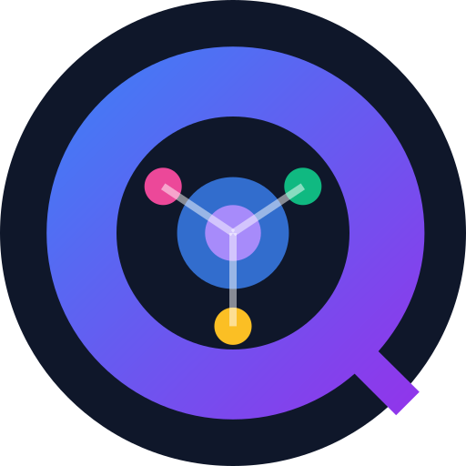
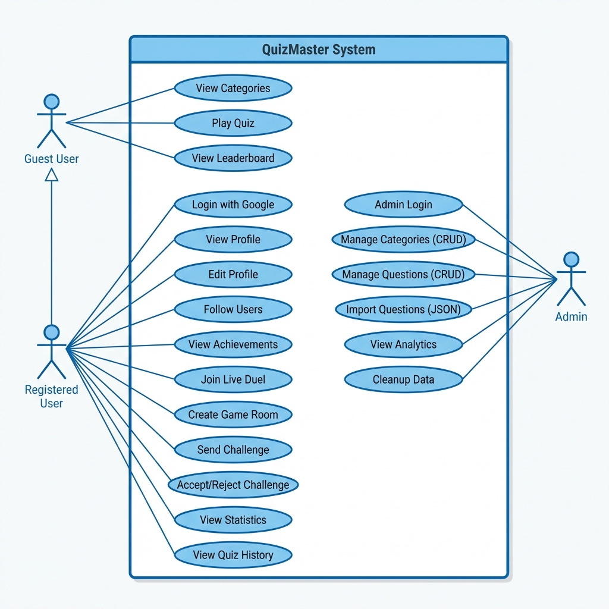
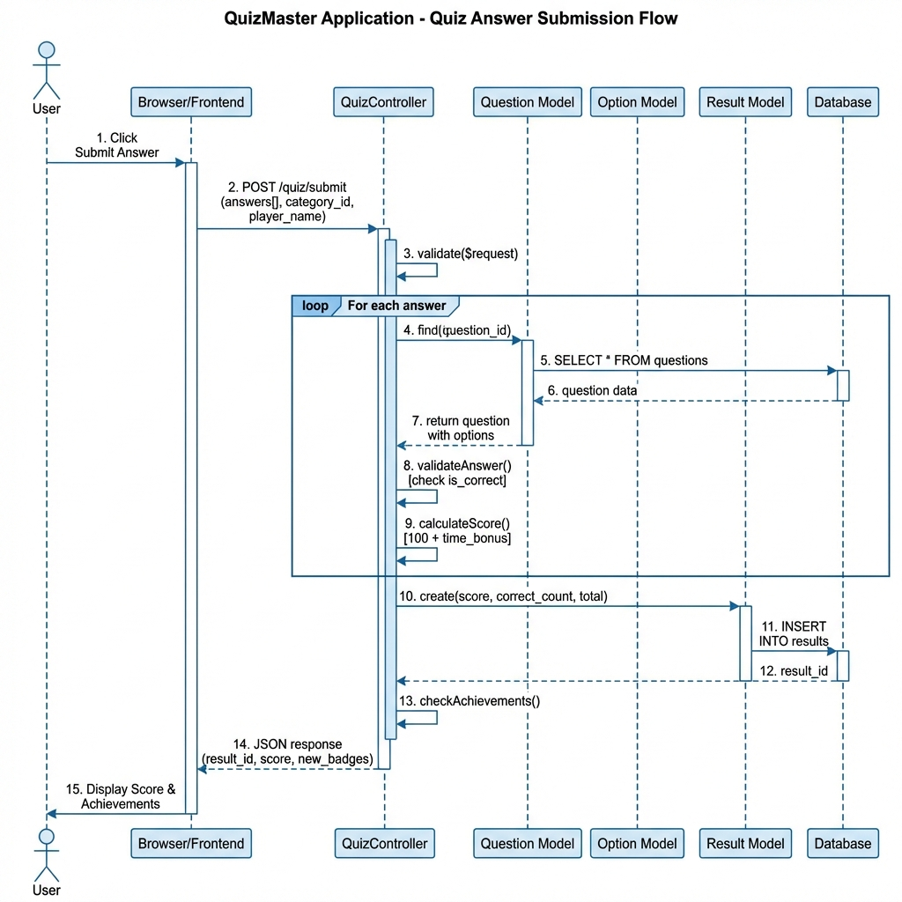

  

  
  
  
  

# QuizMaster Monorepo

QuizMaster adalah platform manajemen dan pelaksanaan kuis adaptif yang mendukung sinkronisasi data antar platform. Dirancang menggunakan arsitektur *Client-Server*, sistem ini memisahkan kontrol administratif *backend* dengan interaksi responsif pada sisi *mobile client*.

## 🏗️ Arsitektur & Repositori

Sistem ini dikelola dalam format *monorepo* yang terdiri dari dua komponen teknis utama:

- 🌐 **[QuizMaster Web (Backend & Admin)](./quiz-master-web/README.md)**
  Berperan sebagai *Core System* dan *API Provider*. Mengelola logika pusat, basis data kuis, dan sinkronisasi status via WebSocket.
  
- 📱 **[QuizMaster Mobile (Android Client)](./quiz-master-mobile/README.md)**
  Aplikasi klien *native* yang efisien dalam mengonsumsi *resource* server untuk menyajikan kuis interaktif bagi pengguna.

---

## 👥 User Story

| Aktor | Skenario | Kebutuhan | Tujuan |
| :--- | :--- | :--- | :--- |
| **Admin** | Manajemen Soal | Mengunggah dan melakukan validasi bank soal secara massal. | Efisiensi pengerjaan dan kebaruan materi kuis. |
| **Admin** | Keamanan Data | Mengelola level akses dan proteksi token pendaftaran. | Menjamin integritas data pengguna dan sistem. |
| **Admin** | Monitoring | Memantau partisipasi aktif pemain secara *real-time*. | Mendapatkan data statistik untuk evaluasi berkala. |
| **Player** | Pengerjaan Kuis | Mengerjakan kuis dalam mode *single-player* atau kompetitif. | Mengevaluasi pemahaman materi secara mandiri. |
| **Player** | Track Record | Mengakses riwayat skor, level, dan pencapaian (*achievements*). | Memonitor progres perkembangan kompetensi. |
| **Player** | Kompetisi | Berpartisipasi dalam peringkat global (*leaderboard*). | Benchmarking kemampuan terhadap basis pengguna lain. |

---

## 📑 Feature List (SRS) - Technical Detail

| Modul | Fitur | Deskripsi Teknis |
| :--- | :--- | :--- |
| **Security** | Auth System | Implementasi Laravel Sanctum untuk *bearer token management* dan Google Socialite. |
| **Management** | JSON Bulk Import | Parser otomatis yang menangani skema data kompleks untuk inisialisasi kuis massal. |
| **Data Logic** | Server-Side Scoring | Kompilasi nilai dilakukan sepenuhnya pada server untuk mitigasi *client-side cheat*. |
| **Sync** | Real-time Engine | Interaksi dua arah (full-duplex) menggunakan Laravel Reverb dan Pusher Client. |
| **Mobile Core** | MVVM Pattern | Arsitektur Android yang memisahkan logika data dari representasi UI melalui LiveData. |
| **API Layer** | REST Gateway | Antarmuka komunikasi *stateless* untuk pertukaran data JSON yang terstandarisasi. |
| **Gamification** | Leveling & XP | Algoritma progresif yang menghitung kenaikan level berdasarkan akumulasi performa. |
| **Analytics** | Global Leaderboard | Agregasi data performa lintas pengguna untuk pemeringkatan kompetitif. |

---

## 📊 Dokumentasi Perancangan (UML)

Sistem dirancang menggunakan metodologi orientasi objek dengan dokumentasi UML sebagai berikut:

| Diagram | Visualisasi | Deskripsi Teknis |
| :--- | :---: | :--- |
| **Use Case** |  | Mendefinisikan interaksi antara Administrator (Web) dan Player (Mobile) dengan sistem. |
| **Activity** |  | Menggambarkan alur kerja sistem mulai dari autentikasi hingga penyelesaian sesi kuis. |
| **Sequence** |  | Menjelaskan urutan pertukaran pesan antar objek untuk fungsi sinkronisasi *real-time*. |
| **ERD** |  | Struktur basis data logis yang menjamin integritas relasi antar entitas kuis dan user. |

---

## 🔄 System Development Life Cycle (SDLC)

Pengembangan proyek ini mengikuti metodologi **Waterfall** yang terstruktur secara sekuensial:

| Fase | Aktivitas Utama | Output |
| :--- | :--- | :--- |
| **Requirements** | Analisis kebutuhan fungsional dan teknis aplikasi kuis. | Dokumen Spesifikasi Kebutuhan. |
| **Design** | Perancangan arsitektur sistem, UI/UX, dan skema database. | Diagram UML & *Wireframe*. |
| **Implementation** | Pengkodean backend (Laravel) dan frontend mobile (Kotlin). | *Source Code* Monorepo. |
| **Testing** | Unit testing dan pengujian integrasi REST API & WebSocket. | Laporan Hasil Pengujian. |
| **Deployment** | Integrasi sistem dan persiapan lingkungan produksi. | Sistem Siap Operasional. |

## 👨‍💻 Profil Pengembang
- **Nama:** Falito Eriano Nainggolan
- **NIM:** 2423102023
- **Program Studi:** Rekayasa Keamanan Siber
- **Institusi:** Politeknik Siber dan Sandi Negara
- **Tahun Akademik:** 2025/2026