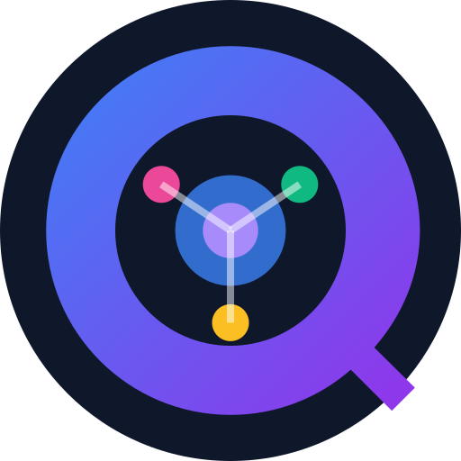

# QuizMaster 

Welcome to **QuizMaster**, a high-fidelity interactive quiz platform. This repository is a unified monorepo containing both the **Android Mobile App** and the **Laravel Backend Service**.

---

## 🏗️ Project Structure

- **[quiz-master-mobile/](file:///c:/xampp/htdocs/QuizMaster/quiz-master-mobile)**: Native Android application built with Kotlin and Jetpack Compose. Features a "Premium" Glassmorphism UI.
- **[quiz-master-web/](file:///c:/xampp/htdocs/QuizMaster/quiz-master-web)**: Robust backend built with Laravel 11, supporting real-time duels, social features, and administrative dashboard.

---

## ✨ Features (Premium Edition)

### 📱 Android App (Mobile)
- **High-Fidelity UI**: Vibrant Mesh Gradients and Advanced Glassmorphism effects.
- **Precision Header UI**: Redesigned Top Stats Bar with circular timer integration and high-contrast labels.
- **Premium Components**: Custom `GlassyCard` and interactive `PremiumButton` with scale animations.
- **Gamification**: Fire-animated Streak Meter, Haptic Feedback, and smooth question transitions.
- **Real-time Scoring**: Synchronized scoring logic (`100 + timeLeft`) mirroring the Laravel backend.
- **Dashboards**: Podium-style Leaderboard and Performance Statistics with Level progression.

### 🌐 Backend (Web & API)
- **Real-Time Duels**: Competitive multiplayer via Laravel Reverb (WebSocket).
- **Comprehensive API**: RESTful endpoints for seamless mobile integration (Leaderboard, Stats, Quiz).
- **Social Engine**: Follow system, Public Profiles, and Achievement badges.
- **Admin Suite**: Comprehensive question management and JSON data import.

---

## 🚀 Quick Start

### 1. Setup Backend
```bash
cd quiz-master-web
composer install
npm install
cp .env.example .env
php artisan key:generate
php artisan migrate --seed
php artisan serve
```

### 2. Setup Android
- Open `quiz-master-mobile` in Android Studio.
- Sync Gradle.
- Update `RetrofitClient.kt` with your server IP.
- Build & Run.

---

## 👨‍💻 Author
Developed with ❤️ by **FalitoNGL**

---

© 2026 QuizMaster by FalitoNGL. Licensed under the MIT License.
