# 📚 Dokumentasi Project (Progress Report)

## QuizMaster - Platform Kuis Interaktif Real-Time


---

## 📖 Deskripsi
QuizMaster adalah platform kuis interaktif berbasis web yang dirancang untuk evaluasi akademik dan hiburan. Aplikasi ini mendukung **Live Duel** (kompetisi real-time antar pengguna), sistem **Gamifikasi** (Achievement & Leaderboard), fitur **Sosial** (Follow & Profile), serta manajemen soal yang komprehensif.

### Tujuan Utama:
- Menyediakan platform pembelajaran interaktif dengan fitur multiplayer
- Meningkatkan motivasi belajar melalui gamifikasi (Achievements, Leaderboard)
- Mendukung berbagai tipe soal (Single, Multiple, Ordering, Matching)
- Memungkinkan kompetisi real-time antar pengguna (Live Duel)
- Memudahkan admin dalam mengelola bank soal dan import data

### Tech Stack:
- **Backend:** Laravel 11
- **Frontend:** Blade Templates + Alpine.js
- **Styling:** TailwindCSS 4
- **Database:** MySQL 8.0
- **Real-time:** Laravel Reverb (WebSocket)
- **Auth:** Google OAuth (Laravel Socialite)
- **Build:** Vite

---

## 📋 User Story

| ID | User Story | Priority |
|----|------------|----------|
| US-01 | Sebagai user, saya ingin login dengan Google agar lebih praktis | High |
| US-02 | Sebagai user, saya ingin mengerjakan kuis dengan timer dan feedback instan | High |
| US-03 | Sebagai user, saya ingin bertanding live dengan teman dalam Game Room | High |
| US-04 | Sebagai user, saya ingin mengirim tantangan langsung ke user lain | Medium |
| US-05 | Sebagai user, saya ingin melihat leaderboard untuk memotivasi diri | Medium |
| US-06 | Sebagai user, saya ingin mendapatkan achievement badges saat mencapai target | Medium |
| US-07 | Sebagai user, saya ingin follow user lain dan melihat profil mereka | Low |
| US-08 | Sebagai admin, saya ingin import soal dari JSON agar efisien | High |
| US-09 | Sebagai admin, saya ingin CRUD kategori dan soal dengan mudah | High |
| US-10 | Sebagai admin, saya ingin melihat statistik pengerjaan kuis | Medium |

---

## 📝 SRS - Feature List

### Functional Requirements
| ID | Feature | Deskripsi | Status |
|----|---------|-----------|--------|
| FR-01 | Google OAuth | Login dengan akun Google via Socialite | ✅ Done |
| FR-02 | Single Player Quiz | Mode latihan dengan feedback per soal | ✅ Done |
| FR-03 | Live Duel | Mode kompetisi real-time via WebSocket | ✅ Done |
| FR-04 | Challenge System | Tantangan langsung antar user dengan notifikasi | ✅ Done |
| FR-05 | Question Types | Single, Multiple, Ordering, Matching | ✅ Done |
| FR-06 | Leaderboard | Ranking berdasarkan skor tertinggi | ✅ Done |
| FR-07 | Gamification | Achievement badges (Newbie, Veteran, dll) | ✅ Done |
| FR-08 | Social Features | Follow user, profil publik, Social Hub | ✅ Done |
| FR-09 | Review Mode | Lihat pembahasan dan jawaban benar | ✅ Done |
| FR-10 | Admin CRUD | Kelola Kategori, Soal, Opsi | ✅ Done |
| FR-11 | JSON Import | Import soal massal dari file JSON | ✅ Done |
| FR-12 | REST API | Endpoint untuk integrasi mobile | ✅ Done |

### Non-Functional Requirements
| ID | Requirement | Deskripsi |
|----|-------------|-----------|
| NFR-01 | Security | Server-side scoring, input validation, CSRF protection |
| NFR-02 | Performance | Real-time scoring via WebSocket, optimized queries |
| NFR-03 | Reliability | Multiple concurrent users dalam Live Duel |
| NFR-04 | Usability | Responsive design, UX intuitif |
| NFR-05 | Interoperability | REST API untuk integrasi dengan aplikasi Mobile |

---

## 📊 UML Diagrams

### Use Case Diagram
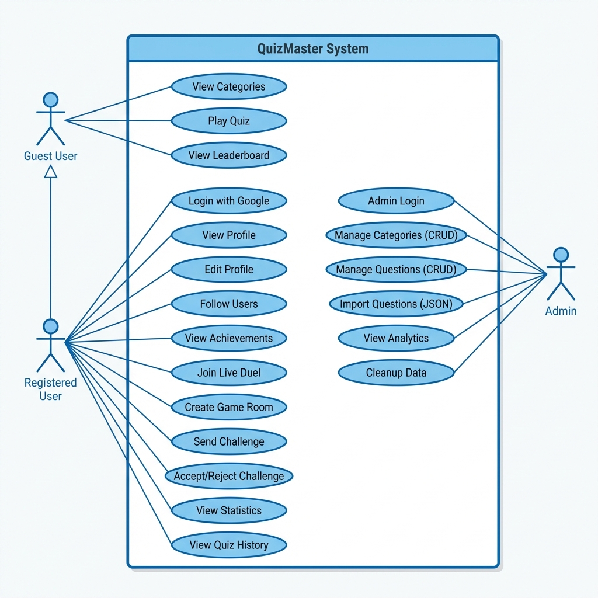

### Activity Diagram - Quiz Flow
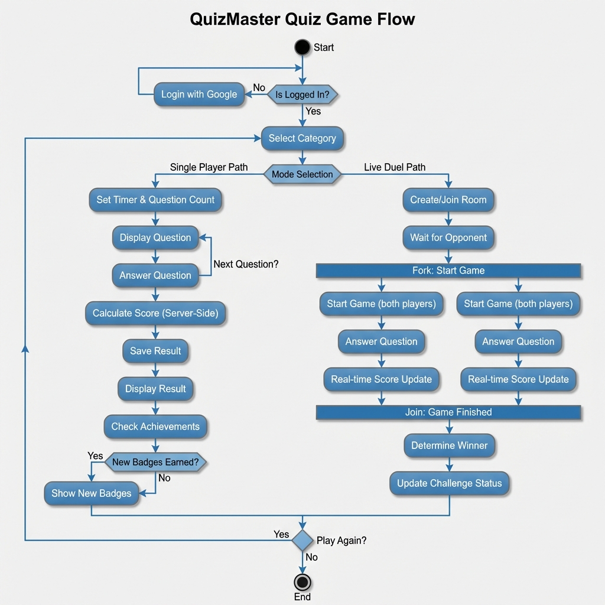

### Sequence Diagram - Submit Answer
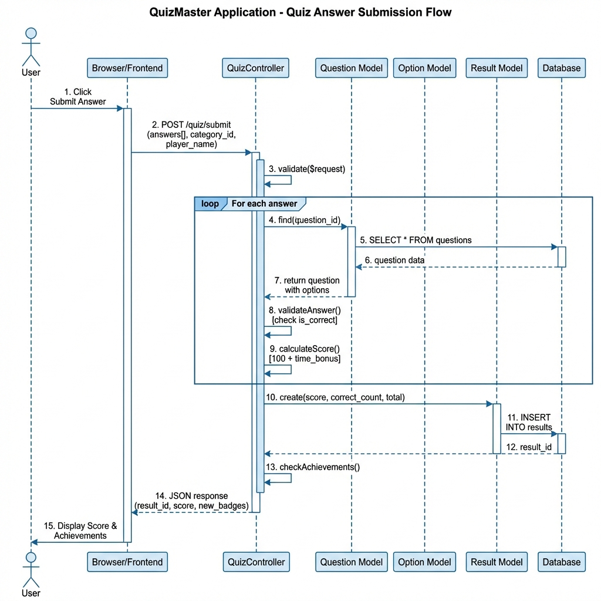

### ERD (Entity Relationship Diagram)
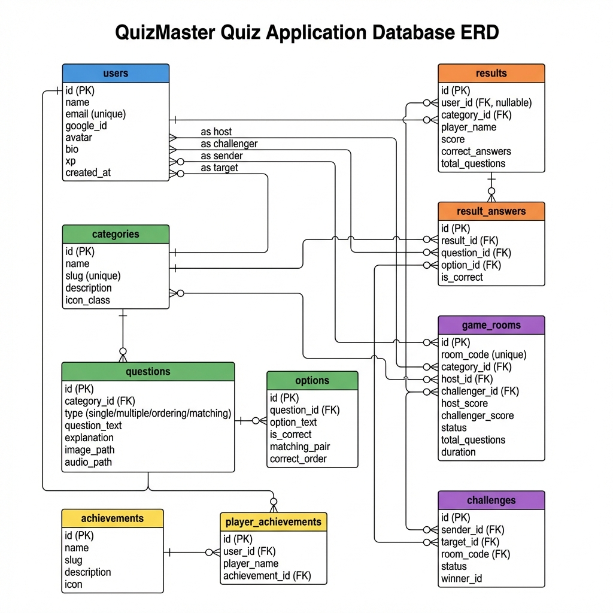

---

## 🎨 Mock-Up / Screenshots

### 1. Halaman Login
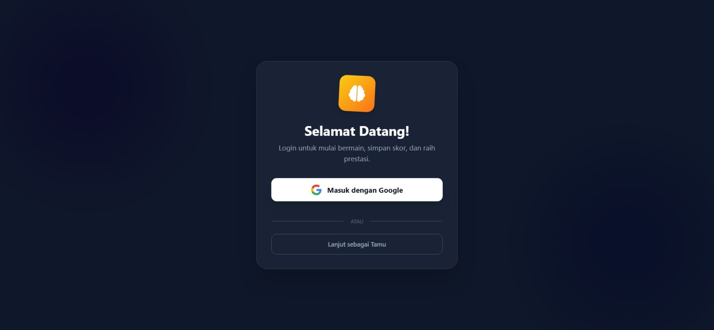

### 2. Halaman Menu Kategori
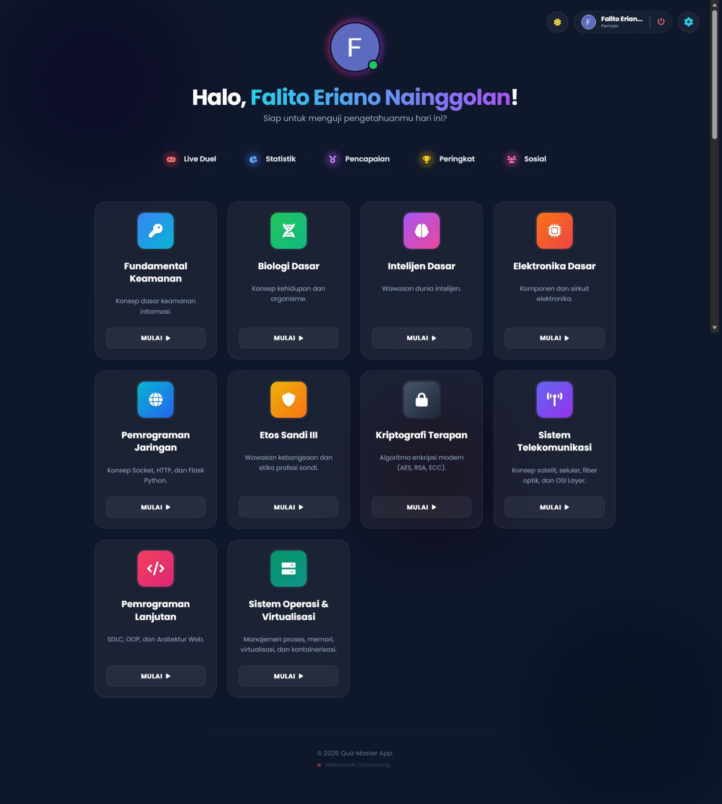

### 3. Tampilan Pengerjaan Soal
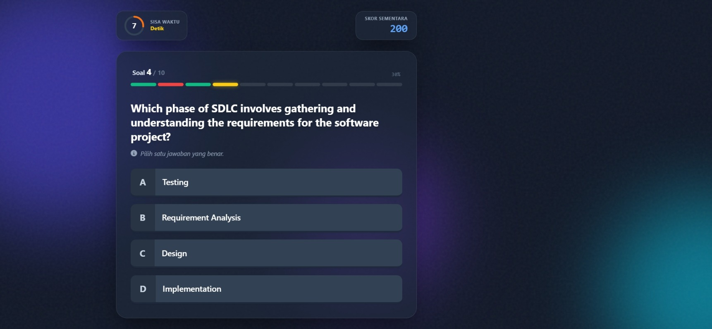

### 4. Live Duel Lobby
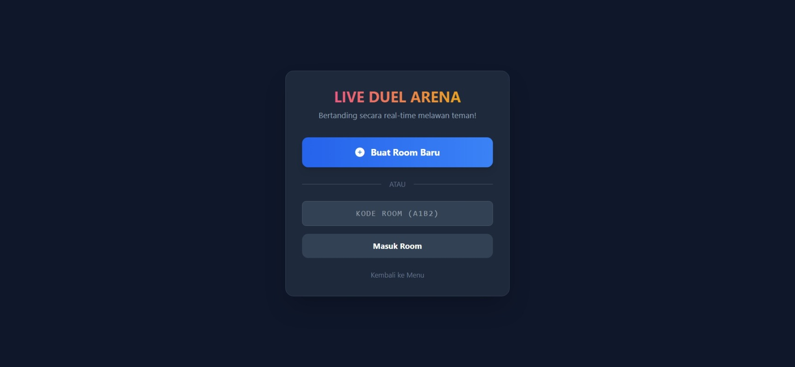

### 5. Leaderboard
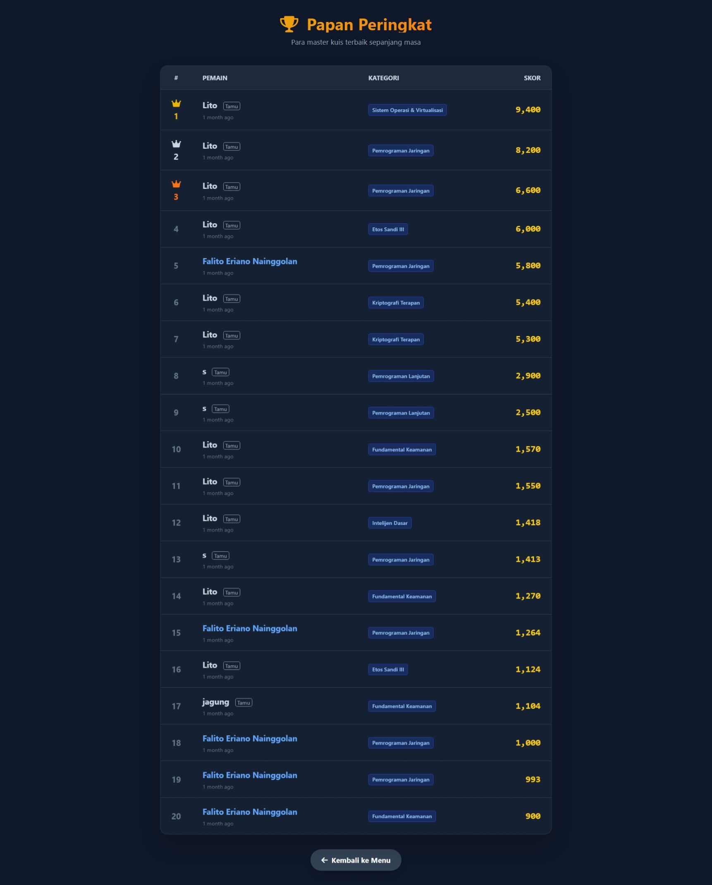

### 6. Achievements
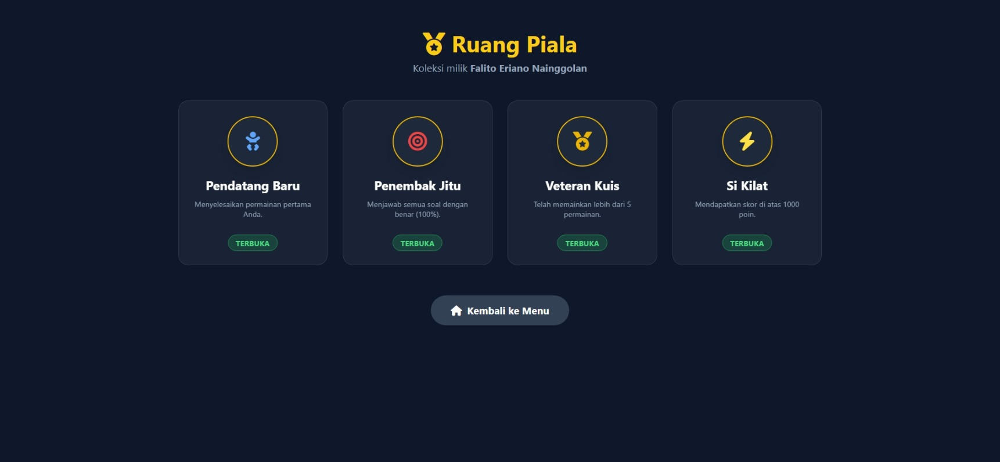

### 7. Admin Dashboard
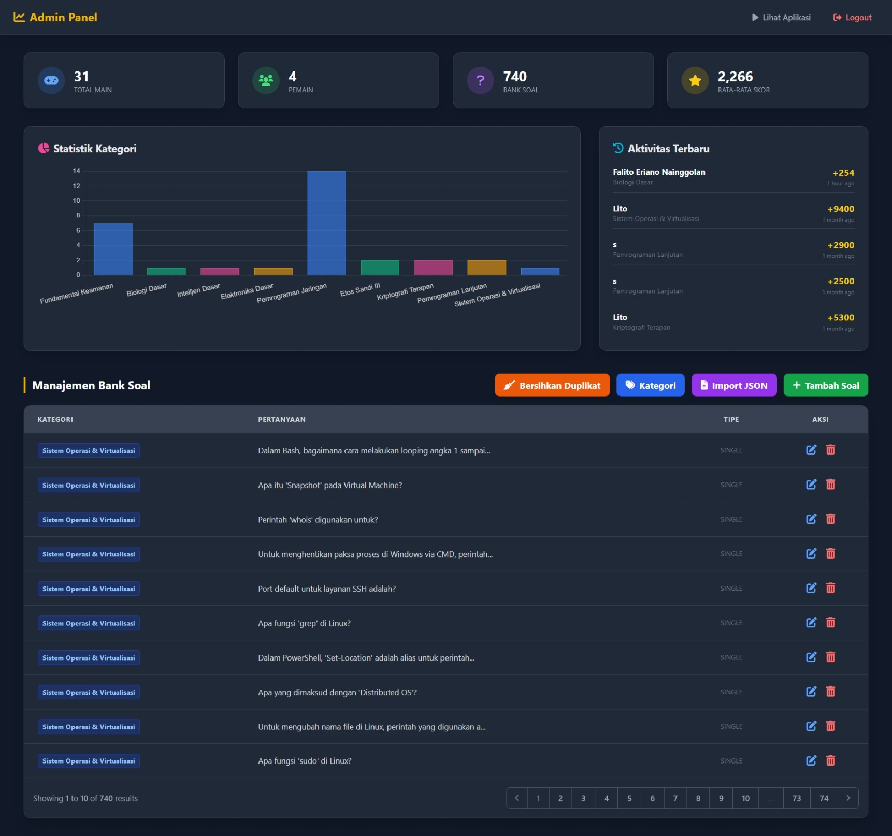

---

## 🔄 SDLC (Software Development Life Cycle)

**Metodologi:** Waterfall dengan iterasi

| Phase | Aktivitas | Output |
|-------|-----------|--------|
| **1. Planning** | Requirement gathering, user story | PRD, User Stories |
| **2. Analysis** | SRS, feature prioritization | Feature List, SRS Doc |
| **3. Design** | UML diagrams, database design, mockups | UML, ERD, Mockups |
| **4. Development** | Coding, unit testing | Source code, tests |
| **5. Testing** | Feature testing, security audit | Test cases (16 tests) |
| **6. Deployment** | Server setup, deployment | Live application |
| **7. Maintenance** | Bug fixes, feature updates | Patches, updates |

### Timeline
```
Minggu 1: Planning & Analysis
Minggu 2: Design (UML, ERD, Mockups)
Minggu 3-4: Development Sprint 1 (Core Features: Quiz, Auth)
Minggu 5-6: Development Sprint 2 (Live Duel, Social Features)
Minggu 7: Development Sprint 3 (Admin Features, API)
Minggu 8: Testing, Security Audit & Deployment
```

---

## 🚀 Instalasi

### Prerequisites
Pastikan Anda sudah menginstall:
- **PHP** >= 8.2
- **Composer** >= 2.0
- **Node.js** >= 18.0
- **NPM** >= 9.0
- **MySQL** >= 8.0
- **Git**

### Langkah 1: Clone Repository
```bash
git clone https://github.com/FalitoNGL/QuizMaster.git
cd QuizMaster/quiz-master-backend
```

### Langkah 2: Install Dependencies
```bash
# Install PHP dependencies
composer install

# Install Node.js dependencies
npm install
```

### Langkah 3: Konfigurasi Environment
```bash
# Copy file environment
cp .env.example .env

# Generate application key
php artisan key:generate
```

**Edit file `.env`** dan sesuaikan konfigurasi database:

```env
DB_CONNECTION=mysql
DB_HOST=127.0.0.1
DB_PORT=3306
DB_DATABASE=quizmaster
DB_USERNAME=root
DB_PASSWORD=

# Google OAuth (opsional)
GOOGLE_CLIENT_ID=your_google_client_id
GOOGLE_CLIENT_SECRET=your_google_client_secret
GOOGLE_REDIRECT_URI=http://localhost:8000/auth/google/callback
```

### Langkah 4: Setup Database
```bash
# Jalankan migrasi dan seeder
php artisan migrate --seed

# Link storage untuk upload file
php artisan storage:link
```

### Langkah 5: Build Assets
```bash
# Build untuk production
npm run build

# atau untuk development (dengan hot reload)
npm run dev
```

### Langkah 6: Jalankan Server
```bash
php artisan serve
```

Aplikasi akan berjalan di: **http://localhost:8000**

### 🔐 Default Account
| Role | Email | Password |
|------|-------|----------|
| Admin | Akses via `/admin/login` | password123 |
| User | Login via Google OAuth | - |

### ⚠️ Troubleshooting
| Error | Solusi |
|-------|--------|
| `SQLSTATE: no such table` | Jalankan `php artisan migrate:fresh --seed` |
| `Vite manifest not found` | Jalankan `npm run build` |
| `Permission denied` | Jalankan `chmod -R 775 storage bootstrap/cache` |
| `Class not found` | Jalankan `composer dump-autoload` |

---

## 📁 Struktur Database
```
users              → User accounts (Google OAuth, avatar, bio, xp)
categories         → Kategori kuis (name, slug, description)
questions          → Bank soal (4 tipe: single/multiple/ordering/matching)
options            → Opsi jawaban dengan is_correct flag
results            → Hasil pengerjaan kuis
result_answers     → Detail jawaban per soal
game_rooms         → Room untuk Live Duel
challenges         → Tantangan antar user
achievements       → Definisi achievement badges
player_achievements → Achievement yang diraih user
```

---

## 🧪 Testing

Jalankan semua test:
```bash
php artisan test
```

### Test Coverage (16 Tests, 48 Assertions)
| Category | Tests |
|----------|-------|
| User Flow | Login → Menu → Quiz → Score |
| API Endpoints | `/api/categories`, `/api/quiz/{id}`, `/api/leaderboard` |
| Security | Auth required for Live, Social, Admin routes |
| Validation | Invalid data rejection, parameter bounds |

---

## 📡 REST API Endpoints

| Method | Endpoint | Deskripsi |
|--------|----------|-----------|
| GET | `/api/categories` | Mengambil semua kategori |
| GET | `/api/quiz/{id}` | Mengambil soal berdasarkan kategori |
| GET | `/api/leaderboard` | Mengambil data skor tertinggi |
| GET | `/api/achievements` | Mengambil achievement user |

### Contoh Response

**GET /api/categories**
```json
{
  "success": true,
  "data": [
    {
      "id": 1,
      "name": "Jaringan Komputer",
      "slug": "jaringan-komputer",
      "questions_count": 50
    },
    {
      "id": 2,
      "name": "Sistem Operasi",
      "slug": "sistem-operasi",
      "questions_count": 35
    }
  ]
}
```

**GET /api/quiz/1**
```json
{
  "success": true,
  "category": {
    "id": 1,
    "name": "Jaringan Komputer",
    "slug": "jaringan-komputer"
  },
  "total_available": 50,
  "questions": [
    {
      "id": 1,
      "question_text": "Apa kepanjangan dari OSI?",
      "type": "single",
      "options": [
        {"id": 1, "option_text": "Open System Interconnection"},
        {"id": 2, "option_text": "Open Source Integration"},
        {"id": 3, "option_text": "Operating System Interface"},
        {"id": 4, "option_text": "Online Service Internet"}
      ]
    }
  ]
}
```

**GET /api/leaderboard**
```json
{
  "success": true,
  "data": [
    {
      "id": 1,
      "player_name": "John Doe",
      "score": 950,
      "category": "Jaringan Komputer",
      "created_at": "2026-01-30T10:00:00Z"
    }
  ]
}
```

---

## 📜 License
This project is licensed under the **MIT License** - see the [LICENSE](LICENSE) file for details.

---

## 👨‍💻 Author
**FalitoNGL**
