<p align="left">
  
  
</p>

# QuizMaster Mobile (Android Client)

Aplikasi klien *native* Android ini dirancang untuk interaksi data intensif dengan efisiensi *resource* tinggi. Aplikasi ini mengimplementasikan sinkronisasi *real-time* dan manajemen sesi terenkripsi.

## 🏗️ Arsitektur: Pola MVVM (Model-View-ViewModel)

Sistem ini menggunakan struktur arsitektur **MVVM** untuk menjamin *separation of concerns* dan kemudahan pengujian.
- **Model**: Mengelola sumber data (Remote API via Retrofit & Websocket).
- **View**: Representasi UI menggunakan Jetpack Compose yang mereaksi terhadap perubahan status.
- **ViewModel**: Bertindak sebagai *bridge* yang menahan status UI dan memproses logika bisnis sebelum ditampilkan ke pengguna.

### Implementasi API Service (Kotlin)
Aplikasi menginisialisasi komunikasi REST melalui pola antarmuka Retrofit yang terstandarisasi.

```kotlin
interface QuizApiService {
    @GET("categories")
    suspend fun getCategories(): Response<ApiResponse<List<Category>>>

    @GET("quiz/{id}")
    suspend fun getQuiz(
        @Path("id") id: Int,
        @Query("limit") limit: Int = 10
    ): Response<QuizResponse>

    @POST("quiz/submit")
    suspend fun submitQuiz(
        @Body request: SubmitRequest
    ): Response<SubmitResponse>
}
```

---

## 🔄 WebSocket & Real-Time Logic
Sinkronisasi sesi kuis memanfaatkan **Pusher Java Client** untuk jalur komunikasi *full-duplex*. Hal ini memungkinkan pembaruan papan peringkat dan status pengerjaan soal secara instan tanpa perlu melakukan *polling* manual ke server.

---

## ⚙️ Setup & IP Configuration Guide

Pengaturan alamat IP server merupakan langkah krusial dalam inisialisasi pengembangan lokal:

1.  **Android Emulator (AVD)**:
    - Buka `RetrofitClient.kt`.
    - Gunakan **Loopback IP**: `http://10.0.2.2:8000/api/`.
2.  **Physical Device (Physical HP)**:
    - Masukkan **IP Local (LAN)** laptop Anda (Cek via `ipconfig` di CMD).
    - Contoh: `http://192.168.1.5:8000/api/`.
3.  **Langkah Android Studio**:
    - Buka proyek > **Gradle Sync**.
    - Sambungkan perangkat > **Run 'app'** (`Shift + F10`).
    - *Pastikan Laptop dan HP berada dalam jaringan WiFi yang identik.*

---

## 📸 Antarmuka Aplikasi Mobile (Gallery)

### 🔐 Auth & Navigasi
| Splash Screen | Login / Register | Home Dashboard |
| :---: | :---: | :---: |
| 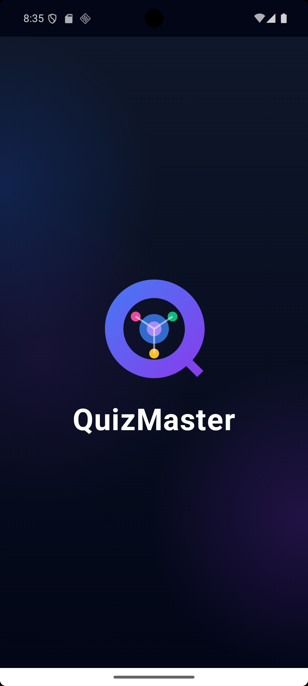 | 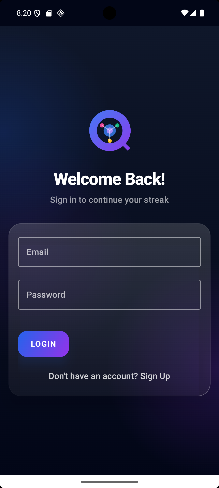 | 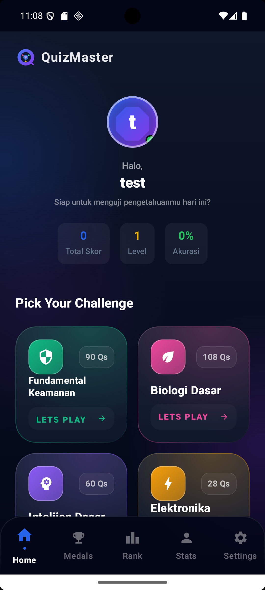 |

### 🎮 Gameplay Experience
| Quiz Arena | Feedback (Benar) | Feedback (Salah) |
| :---: | :---: | :---: |
| 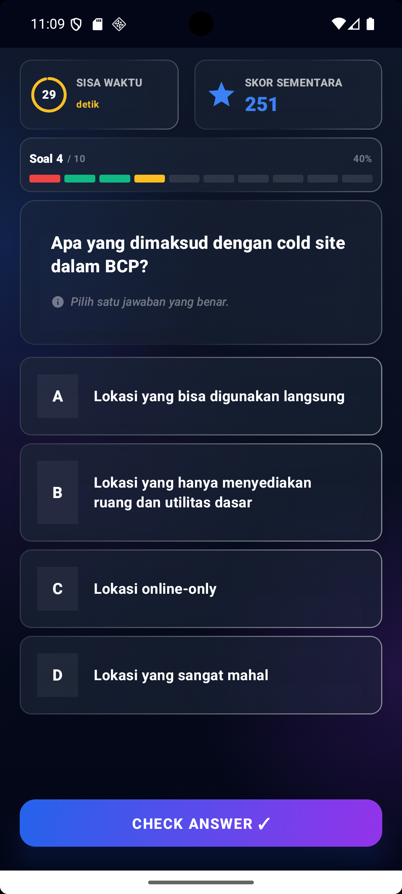 | 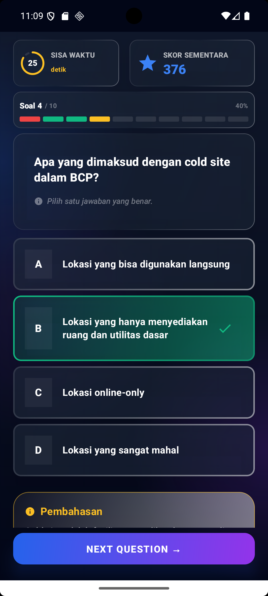 | 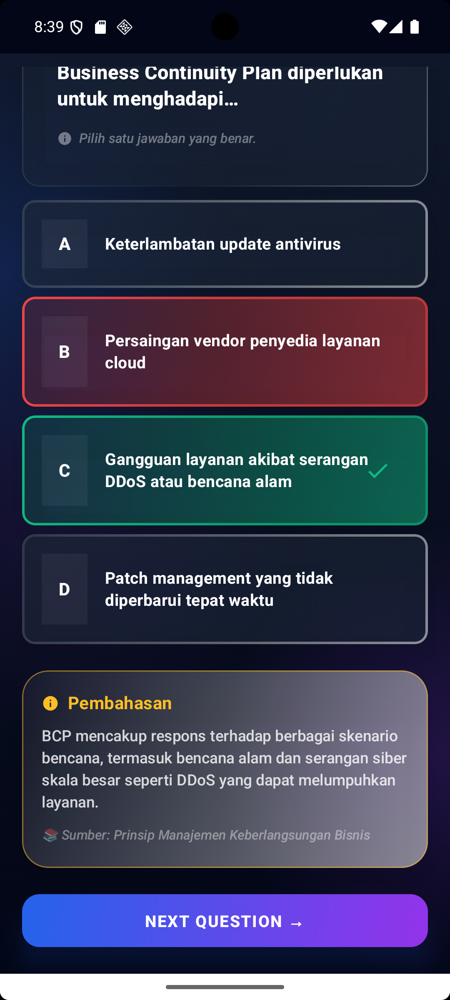 |

### 📊 Hasil, Stats & Social
| Quiz Result | Global Leaderboard | Profile Stats |
| :---: | :---: | :---: |
| 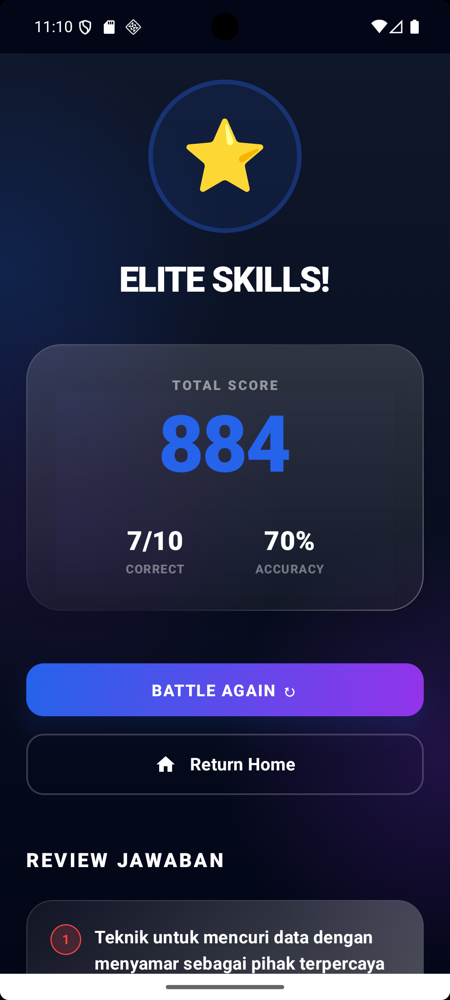 | 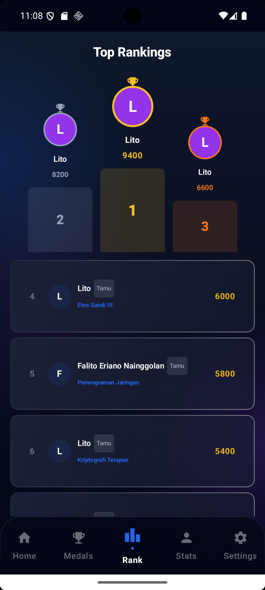 | 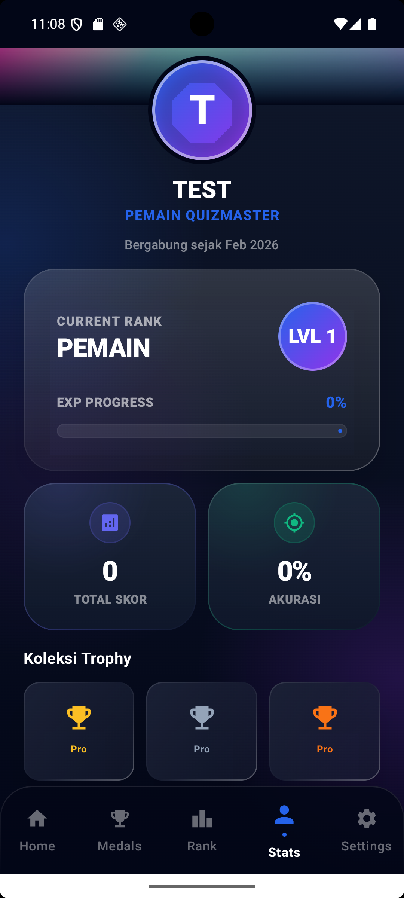 |

| Achievement Wall | Settings & Prefs |
| :---: | :---: |
| 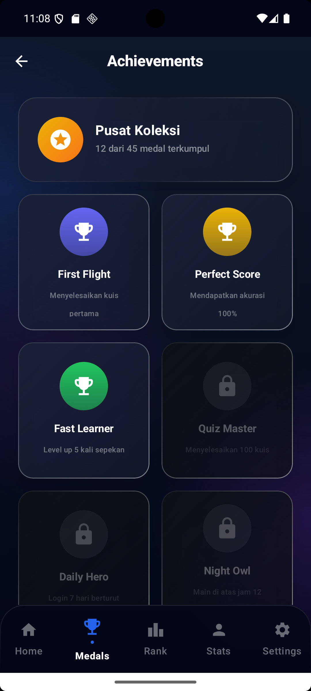 | 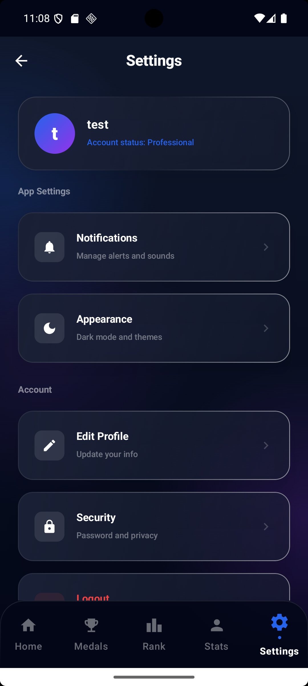 |